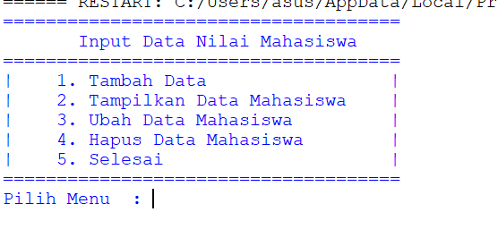
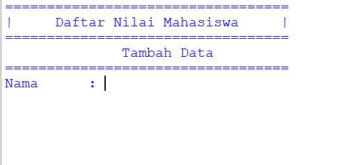
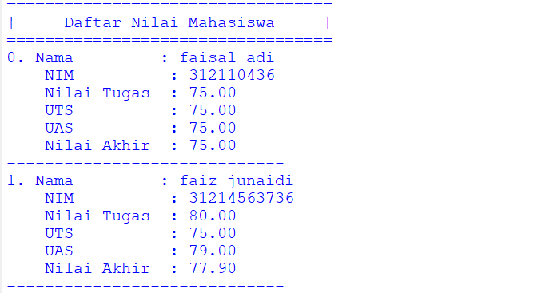
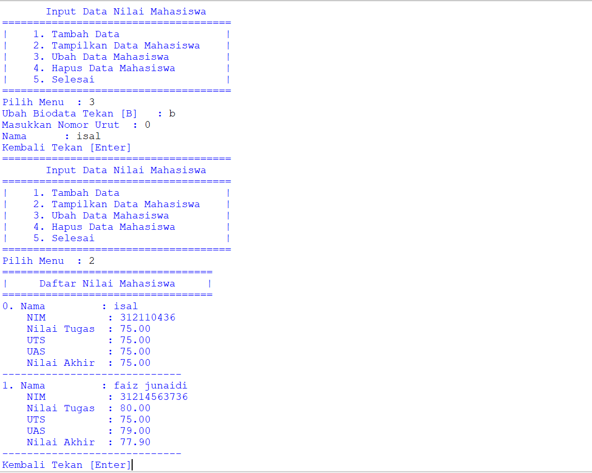
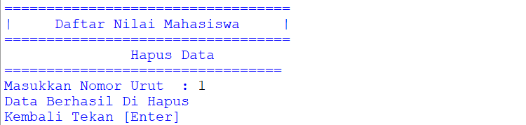

# labs06

### latihan 1
* Berikut penjelasanya 

```python
from os import system
```
<p> Diatas code untuk mengimport, untuk mendapatkan clear system pada system os<p>

```python
nama1 = []
nim1 = []
tugas1 = []
uts1 = []
uas1 = []
akhir1 = []
```
<p> Code diatas adalah program daftar nilai mahasiswa, maka kita buat terlebih dahulu list nya<p>

```python
def judul():
    print('==================================')
    print('|     Daftar Nilai Mahasiswa     |')
    print('==================================')
```
<p>Biatas code untuk menampilkan fungsi judul, karna ini function jadi kita bisa memanggil fungsi ini berkali kali, tanpa harus menulis ulang programnya, kita hanya perlu lmemanggilnya dengan cara mengetikan program *Contoh : fungsi()<p>

```python
def menu():
    system("cls")
    print("="*37)
    print("Input Data Nilai Mahasiswa".center(40))
    print("="*37)
    print("|    1. Tambah Data                 |")
    print("|    2. Tampilkan Data Mahasiswa    |")
    print("|    3. Ubah Data Mahasiswa         |")
    print("|    4. Hapus Data Mahasiswa        |")
    print("|    5. Selesai                     |")
    print("="*37)
    pilih = input("Pilih Menu  : ")
    if pilih == "1":
        tambah()
    elif pilih == "2":
        tampilkan()
    elif pilih == "3":
        ubah()
    elif pilih == "4":
        hapus()
    elif pilih == "5":
        selesai()
    else:
        tidak = input("Menu Tidak Ada")
        system("cls")
        menu()
```
<p>Diatas adalah code untuk membuat fungsi menu<p>

* Berikut ketika program dijalankan .



```python
def tambah():
    system('cls')
    judul()
    print('Tambah Data'.center(40))
    print('==================================')
    nama = input('Nama     : ')
    s_nama.append(nama)
    nim = input('NIM       : ')
    s_nim.append(nim)

    system('cls')
    judul()
    print('Tambah Data'.center(40))
    print('==================================')
    tugas = float(input('Nilai Tugas    : '))
    s_tugas.append(tugas)

    uts = float(input('Nilai UTS        : '))
    s_uts.append(uts)

    uas = float(input('Nilai UAS        : '))
    s_uas.append(uas)

    total = tugas * 0.30 + uts * 0.35 + uas * 0.35
    s_akhir.append(total)
    print('Data Tersimpan'.center(40))
    kembali = input('Kembali [Enter]')
    menu()
```

<p>code diatas untuk membuat fungsi tambah yang ada dalam program ini

* berikut tampilan ketika program dijalankan <p>



```python
def tampilkan():
    system('cls')
    judul()

    for i in range(len(s_nim)):

        print('%d. Nama         : %s'%(i+0, s_nama[i]))
        print('    NIM          : %s'%s_nim[i])
        print('    Nilai Tugas  : %.2f'%s_tugas[i])
        print('    UTS          : %.2f'%s_uts[i])
        print('    UAS          : %.2f'%s_uas[i])
        print('    Nilai Akhir  : %.2f'%s_akhir[i])
        print('-----------------------------')
    kembali = input('Kembali Tekan [Enter]')
    menu()
```
<p> Code diatas adalah untuk membuat fungsi tampilkan yang ada dalam program ini <p>

* Berikut ketika program dijalankan 


```python
def ubah():
    rubah = input("Ubah Biodata Tekan [B]   : ")
    if rubah == "B" or rubah == "b":
        i = int(input("Masukkan Nomor Urut  : "))
        if (i > len(nim1[i])):
            print("Nomor Urut Salah")
        else:
            namabaru = input("Nama      : ")
            nama1[i] = namabaru
    kembali = input("Kembali Tekan [Enter]")
    menu()
```
<p>Diatas adalah code untuk membuat fungsi untuk merubah nama dalam data, dengan ketentuan, jika menekan angka 3 maka muncul konfirmasi dan harus menginputkan/menekan huruf b setelahnya juga harus menginputkan no urut data yang ingin di ubah.<p>

* Bertikut program ketika dijalankan


```python
def hapus():
    system("cls")
    judul()
    print("Hapus Data".center(40))
    print("="*34)
    i = int(input("Masukkan Nomor Urut  : "))

    if (i > len(nim1[i])):
        tidak = input("NIM Tidak Ada")
        hapus()
    
    else:
        nim1.remove(nim1[i])
        nama1.remove(nama1[i])
        tugas1.remove(tugas1[i])
        uts1.remove(uts1[i])
        uas1.remove(uas1[i])
        akhir1.remove(akhir1[i])

    print("Data Berhasil Di Hapus")
    kembali = input("Kembali Tekan [Enter]")
    menu()
```
<p>Diatas adalah code untuk membuat fungsi menghapus salah satu dari data dalam list.

* Berikut program ketika dijalankan 


<p>Dan berikut adalah program untuk fungsi mengakhiri program, dengan menekan angka 5 maka akan menyekesaikan program.

```python
def selesai():
    system("cls")
    menu()

menu()
```
### Selesai 